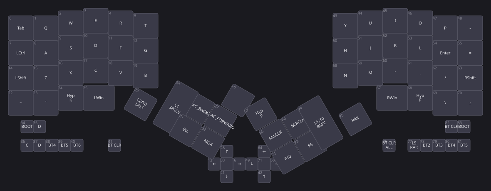
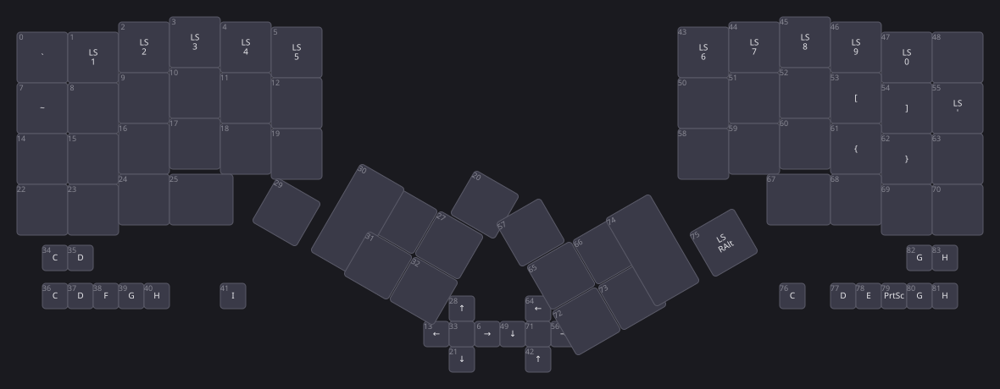
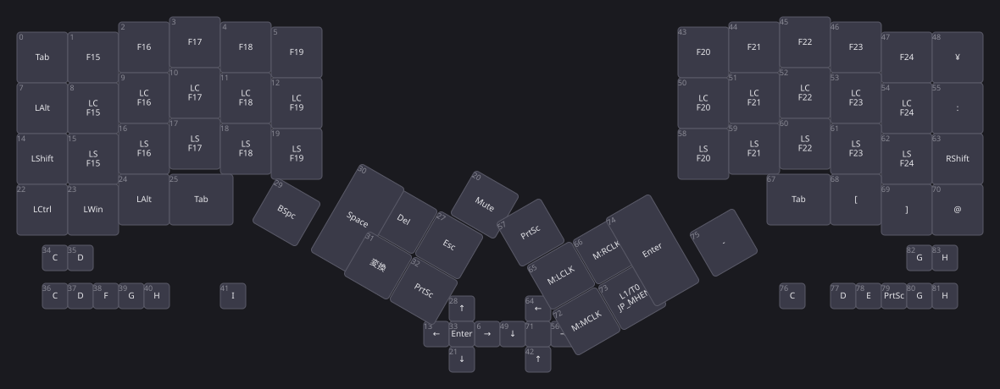
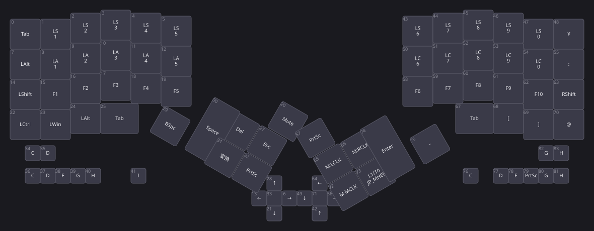

# MoooseFree キーマップレイアウト

`config/MoooseFree.keymap` の各レイヤーをビジュアル化したもの。
キーの左上の小さな数字は `bindings` 配列内のインデックス (combos の `key-positions` で参照する番号)。

## Layer 0 — default



## Layer 1 — ARROW


## Layer 2 — NUM



## Layer 3 — AHK



## Layer 4 — FUNCTION



## Combos

| Name  | Layers | Key positions | Binding      |
|-------|--------|---------------|--------------|
| lang1 | 0      | 51, 52        | `&kp LANG1`  |
| lang2 | all    | 10, 11        | `&kp LANG2`  |

## 凡例

| 表記            | 意味                                                    |
|-----------------|---------------------------------------------------------|
| `Hyp`           | `LC(LS(LA(LG(...))))` (Hyper)                           |
| `Meh`           | `LC(LS(LA(...)))` (Meh)                                 |
| `LS/LC/LA/LG+`  | Shift / Ctrl / Alt / GUI 単独修飾                       |
| `L<n>`          | `&lt <n> <key>` — ホールドでレイヤー n、タップでキー    |
| `L<n>/T0`       | `&lt_to_layer_0 <n> <key>` — ホールドで n、タップで 0   |
| `MO<n>`         | `&mo <n>` — モーメンタリレイヤー切替                    |
| `M:<btn>`       | `&mkp <btn>` — マウスボタン                             |
| `BT<n>`         | `&bt BT_SEL <n>`                                        |
| `BOOT`          | `&bootloader`                                           |
| (空白)          | `&none`                                                 |

## 再生成

```sh
python3 scripts/gen_layout_svgs.py
```
